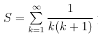

Решить задачу, организовав итерационный цикл. Вычислить сумму ряда

расчет продолжать до тех пор, пока приращение R

будет больше заданной точности ξ < 10^−3 , 10^−4 . Определить, как изме-
няется число итераций при изменении точности.